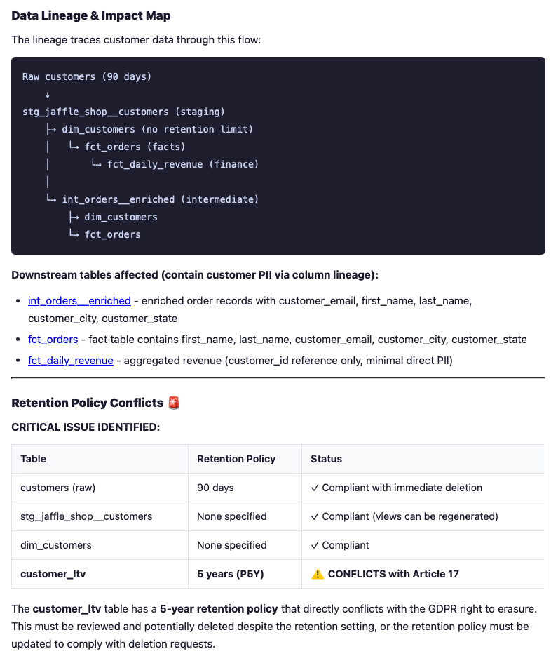

# GDPR DSAR Compliance

Trace customer data across your data catalog to handle GDPR Data Subject Access Requests (DSARs) for deletion, access, or rectification.

## Overview

When a customer requests data deletion under GDPR (e.g., "delete all my data"), this workflow:
1. Receives the customer's identifiers (name, email, customer ID)
2. Uses a Metadata AI agent to **search for tables** where the customer's data may reside
3. **Traces lineage** from those tables to discover related upstream sources and downstream copies
4. **Inspects table details** (columns, tags) to flag fields that likely contain PII
5. **Checks retention policies** on each table to identify conflicts with immediate deletion
6. Produces a structured compliance report with deletion steps, retention conflicts, and impact assessment

## Prerequisites

- Collate/OpenMetadata instance with metadata ingested (tables, lineage, retention policies)
- PII classification tags applied to relevant assets (or auto-classification configured)
- API access enabled (JWT token)
- [Metadata AI CLI](../../cli/) or SDK installed (for agent setup)

## Architecture

```
┌────────────┐     DSAR request     ┌──────────────────────┐
│  Browser   │ ───────────────────► │ GDPRCompliance       │
│  (UI form) │                      │ Analyzer Agent       │
└─────┬──────┘                      └──────────┬───────────┘
      │                                        │
      │  SSE stream                            │ 1. searches for customer tables
      │◄───────────────────────────────────────┘ 2. traces lineage for related tables
      │                                          3. inspects columns for PII
      ▼                                          4. checks retention policies
┌────────────┐
│ Compliance │
│ Report     │
└────────────┘
```

## Step 1: Create the Agent

Create a Dynamic Agent with PII search and lineage tracing abilities.

See [agent-config.md](./agent-config.md) for detailed setup instructions using the CLI, UI, or SDKs.

**Quick setup with CLI:**

```bash
# Create the Persona
ai-sdk personas create \
  --name GDPRAnalyst \
  --description "GDPR compliance and PII analysis specialist" \
  --prompt "You are a GDPR compliance analyst. You MUST execute the full analysis yourself and produce a complete compliance report. Do NOT stop to ask the user what to do next — complete every step autonomously.

When a customer requests data deletion, execute ALL of these steps:

STEP 1 — SEARCH: Search for tables where the customer's data likely resides (e.g., 'customers', 'payments', 'orders'). Use the search tools to find them.

STEP 2 — TRACE LINEAGE: For EACH table found in Step 1, trace its lineage (both upstream and downstream). Do this yourself — call the lineage tools for every table. This will reveal derived views, staging tables, marts, and analytics tables that also contain customer data.

STEP 3 — INSPECT TABLE DETAILS: For EACH table discovered (from both Step 1 and Step 2), get its full details — columns, tags, classifications, and retention period. Do not skip any table.

STEP 4 — PRODUCE THE FULL COMPLIANCE REPORT with these sections:
  a) A table listing every affected asset with: table name, PII columns found, retention period, and whether there is a retention conflict
  b) Retention conflicts: flag every case where a downstream table has a longer retention than its source (e.g., a view with P5Y retention pulling email from a P90D source table)
  c) Recommended deletion order respecting foreign key dependencies
  d) Risk flags: orphaned FK references, free-text fields with unstructured PII, PII duplicated across tables with different retention

IMPORTANT: Do not present intermediate findings and ask the user for next steps. Execute the full workflow and deliver the complete report."

# Create the Agent
ai-sdk agents create \
  --name GDPRComplianceAnalyzer \
  --description "Handles GDPR deletion requests by searching for customer data, tracing lineage, and checking retention policies" \
  --persona GDPRAnalyst \
  --abilities discoveryAndSearch,dataLineageAndExploration \
  --api-enabled true
```

## Step 2: Configure the Token

Open `cookbook/gdpr-dsar-compliance/index.html` and set your JWT token:

```javascript
const TOKEN = "your-jwt-token";
```

## Step 3: Start the Demo

```bash
# From the repo root — bundles the SDK and starts the server
make demo-gdpr

# Or override the OpenMetadata host / port:
AI_SDK_HOST=https://your-instance.getcollate.io PORT=3000 make demo-gdpr
```

Open `http://localhost:8080` (or the port you specified).

## Step 4: Submit a DSAR

Type your Data Subject Access Request in the text area and click **Submit Request** (or press `Ctrl+Enter`).

The agent will stream its response in real-time, showing which tools it uses (searching the catalog, tracing lineage) as it builds the compliance report.



### Example Prompts

**Deletion request (recommended starting point):**
```
Customer Michael Perez has requested
deletion of all his personal data under GDPR Article 17. Search for tables where
his data resides, trace lineage to find all related tables, identify PII columns
in each, and check retention policies for conflicts with immediate deletion.
```

**Access request:**
```
Customer Sara Chen has submitted a
Subject Access Request under GDPR Article 15. Find all tables containing her
data by searching for customer-related tables and tracing lineage. For each
table, list the PII columns and the retention period.
```

**Rectification request:**
```
Customer Diana Williams has requested rectification
of her address data under GDPR Article 16. Search for tables that store address
information, trace lineage to find downstream copies, and identify all locations
where her address data may need to be updated.
```

**Scope assessment:**
```
We need to assess the GDPR deletion impact for the customers table in the
jaffle shop database. Trace all downstream lineage from the customers table,
identify which downstream tables contain PII, and check whether their retention
policies are compatible with a 90-day customer data retention window.
```

## How It Works

The HTML file imports the [TypeScript SDK](../../typescript/) as a browser ES module bundled with esbuild. It uses the SDK's `agent().invoke()` method to get the complete compliance report after the agent finishes all tool calls (search, lineage, detail inspection):

```javascript
import { AISdk } from './ai-sdk.js';

const client = new AISdk({ host: HOST, token: TOKEN });

const result = await client.agent(AGENT_NAME).invoke(message);
// result.response contains the full compliance report (markdown)
// result.toolsUsed lists all tools the agent called
```

The agent executes multiple tool calls server-side (searching tables, tracing lineage, inspecting details) before returning the complete report. The same pattern works in Node.js for scripting or automation.

## Customization

### Adjust the Agent Persona

Edit the persona system prompt to focus on your organization's specific needs:
- Add references to your naming conventions (e.g., `*_pii` column suffix)
- Include your specific retention policy rules and legal hold requirements
- Specify the output format you need (JSON, markdown table, etc.)
- Adjust the lineage depth the agent should trace

See [agent-config.md](./agent-config.md) for the full system prompt template.

### Add to an Automated Workflow

Combine this with n8n or a scheduled script to process DSARs from a queue:

```python
from ai_sdk import AISdk

client = AISdk(host="https://...", token="...")

# Process a DSAR from your ticketing system
response = client.agent("GDPRComplianceAnalyzer").invoke(
    "Customer Michael Perez (customer_id: 1, email: mperez@example.com) has "
    "requested deletion of all his personal data. Search for tables where his "
    "data resides, trace lineage, identify PII, and check retention policies."
)

# Send the compliance report to your DSAR tracking tool
print(response.content)
```

## Troubleshooting

| Issue | Solution |
|-------|----------|
| No response from agent | Verify `TOKEN` is correct; check browser console for errors |
| Agent returns empty analysis | Ensure PII classification tags are applied to your assets in Collate |
| CORS error in browser | Use `serve.js` instead of a plain static server — it proxies API calls |
| `Proxy error` in response | Check that `AI_SDK_HOST` is reachable from where `serve.js` runs |
| Tool usage not showing | The agent may not need tools for simple queries; try a more specific request |

## Related Resources

- [Metadata AI TypeScript SDK](../../typescript/)
- [Metadata AI Python SDK](../../python/)
- [Metadata AI CLI](../../cli/)
- [Collate PII Classification Documentation](https://docs.getcollate.io)


## Demo Scenario: Michael Perez Requests Erasure

This demo is built around a concrete DSAR scenario using the Jaffle Shop demo database.

**The request:** Michael Perez (`customer_id=1`, `mperez@example.com`) wants all his personal data deleted under GDPR Article 17.

### What the Agent Should Do

1. **Search for customer tables** — The agent searches for "customer" tables and finds `raw_jaffle_shop.customers` as the primary source of customer data.

2. **Trace lineage** — From the customers table, the agent traces downstream lineage and discovers related tables: `orders`, `payments`, `user_sessions`, `tickets`, `reviews`, and the `analytics.customer_ltv` view.

3. **Inspect PII in each table** — For each discovered table, the agent inspects columns and tags to identify PII fields (email, phone, SSN, IP address, billing_email, free-text description fields, etc.).

4. **Check retention policies** — Each table has a retention period set. The agent should flag conflicts:

| Table | PII Present | Retention | Conflict |
|-------|-------------|-----------|----------|
| `customers` | email, phone, SSN, DOB, address | P90D | Source of truth — supports deletion |
| `payments` | billing_email, IP address | P180D | PII persists 90 days after customer record deleted |
| `orders` | customer_id FK | P3Y | Pseudonymous link survives ~3 years |
| `user_sessions` | customer_id FK, IP address | P1Y | Browsing PII survives 9 months after customer gone |
| `tickets` | free-text description | P1Y | May mention customer name/details |
| `reviews` | free-text review_text | P1Y | Unstructured PII risk |
| `customer_ltv` view | email + full name directly | P5Y | Exposes PII from deleted source for ~5 years |

### Key Flags the Agent Should Raise

1. **Billing email duplication** — `payments.billing_email` stores the same email as `customers.email` but with 2x longer retention
2. **Aggregated view leaks source PII** — `analytics.customer_ltv` selects `c.email` and `first_name || last_name` but has a 5Y retention vs 90D on the source table
3. **FK orphan chain** — Deleting from `customers` orphans `orders`, which orphans `payments`, which orphans `refunds` — cascading integrity issues
4. **Free-text PII in support tickets** — The `description` field in tickets and `review_text` in reviews may contain customer names or details that can't be systematically purged
