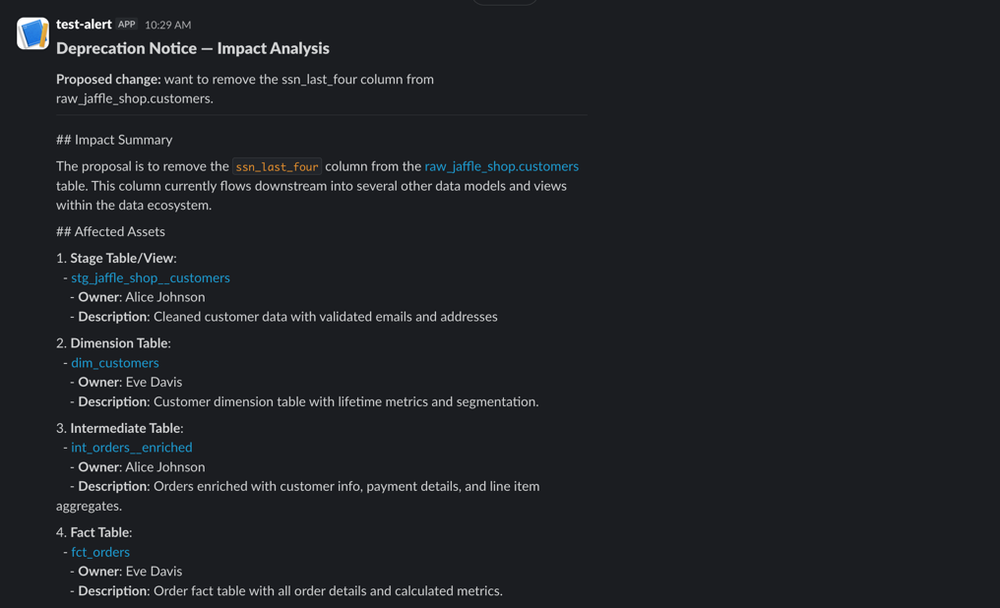

# MCP Impact Analysis: Data Change Assessment

Automate impact analysis for schema changes using OpenMetadata's MCP tools. This cookbook shows how to build an AI-powered assistant that helps data engineers understand the downstream impact before modifying tables, columns, or pipelines.

## Business Problem

**Scenario:** Your team needs to deprecate the `ssn_last_four` column from the `customers` table due to compliance requirements. Before making this change, you need to answer:

1. What downstream tables, views, and dashboards depend on this column?
2. Who owns those assets and should be notified?
3. Are there data quality tests that will fail?
4. What's the blast radius of this change?

**Traditional approach:** Manually query lineage graphs, check documentation, send emails. This takes hours and often misses dependencies.

**With MCP tools:** Ask an AI assistant that queries your metadata catalog in real-time and provides a comprehensive impact report in seconds.

## Prerequisites

- [Demo Database](../demo-database/) running with data ingested into OpenMetadata
- Python 3.10+
- OpenAI API key (or use any LangChain-compatible LLM)

## Installation

```bash
pip install data-ai-sdk[langchain] langchain langchain-openai
```

## Environment Setup

```bash
# OpenMetadata credentials
export AI_SDK_HOST="https://your-openmetadata.com"
export AI_SDK_TOKEN="your-jwt-token"

# LLM API key
export OPENAI_API_KEY="your-openai-key"

# (Optional) Slack integration for deprecation notices
export SLACK_WEBHOOK_URL="https://hooks.slack.com/services/T00/B00/xxxx"
```

## The Impact Analysis Agent

The interactive agent is implemented in [`impact_analyzer.py`](./impact_analyzer.py). Here's how it works:

1. **MCP tool selection** - It initializes an `AISdk` client and loads only the read-only MCP tools (`search_metadata`, `get_entity_details`, `get_entity_lineage`). Mutation tools are excluded so the agent can never modify your catalog during analysis.

2. **System prompt** - A structured prompt instructs the LLM to follow a repeatable workflow: find the asset, trace lineage, identify owners, assess risk, and summarize the impact. The prompt also enforces a consistent output format with sections for affected assets, risk assessment, and recommended actions.

3. **LangChain agent loop** - The tools and prompt are wired into a LangChain `AgentExecutor` with `max_iterations=10`, giving the LLM enough room to chain multiple tool calls (e.g., search for a table, get its details, then traverse its lineage).

4. **Entity links** - The system prompt is configured with your `AI_SDK_HOST` so every entity in the report is a clickable link back to OpenMetadata (e.g., `[dim_customers](https://your-host/table/jaffle_shop.public.dim_customers)`).

5. **Interactive REPL** - The `main()` function provides a terminal loop where you describe a planned change in plain English and receive a structured impact report.

6. **Slack integration** - After each report, the tool asks whether to send a deprecation notice to Slack. If you confirm, it posts a formatted message via an Incoming Webhook so the right people are pinged and the conversation starts in your organization.

Run it with:

```bash
python impact_analyzer.py
```

## Example Interactions

### Example 1: Column Deprecation

**Input:**
```
I want to remove the ssn_last_four column from raw_jaffle_shop.customers.
What's the impact?
```

**Expected Response:**

The agent will call `search_metadata` to locate the table, then `get_entity_lineage` to walk the downstream graph, and finally `get_entity_details` on each affected node. A typical report looks like:

```markdown
## Impact Summary
Removing `ssn_last_four` from `raw_jaffle_shop.customers` affects 3 downstream
assets across 2 schemas. This is a **medium-risk** change due to the sensitive
nature of the data.

## Affected Assets

| Asset | Type | Schema | Owner |
|-------|------|--------|-------|
| stg_jaffle_shop__customers | View | staging | data-engineering@jaffle.shop |
| dim_customers | Table | marts_core | analytics@jaffle.shop |

Note: The column is not propagated beyond staging as it's filtered in the
stg_jaffle_shop__customers model.

## Risk Assessment

**Data Quality:**
- No DQ tests reference this column directly
- The staging model filters it out, so downstream tests unaffected

**Compliance:**
- POSITIVE: Removing SSN data reduces compliance burden
- Ensure data retention policies allow deletion

**Business:**
- No dashboards reference this column
- No active queries in pg_stat_statements use this column

## Recommended Actions

1. **Notify stakeholders:**
   - data-engineering@jaffle.shop (staging model owner)

2. **Update assets:**
   - Remove column reference from `stg_jaffle_shop__customers.sql`
   - Update dbt schema documentation

3. **Migration steps:**
   - Add column to staging model exclusion list (already excluded)
   - Drop column from source table
   - Run full dbt refresh
```

### Example 2: Table Restructure

**Input:**
```
We're planning to split raw_stripe.payments into two tables:
payments_transactions and payments_methods. What will break?
```

**Expected Response:**

Because `raw_stripe.payments` sits at the root of the finance lineage chain, the agent will discover a deep dependency graph. It calls `get_entity_lineage` on the payments table, then iterates through each downstream node with `get_entity_details` to check for owners, DQ tests, and PII tags.

```markdown
## Impact Summary
Splitting `raw_stripe.payments` is a **high-risk** change affecting 6 downstream
assets including critical finance marts. This requires coordinated migration.

## Affected Assets

| Asset | Type | Schema | Owner | Risk |
|-------|------|--------|-------|------|
| stg_stripe__payments | View | staging | data-engineering | HIGH |
| int_orders__enriched | View | intermediate | data-engineering | HIGH |
| fct_orders | Table | marts_core | analytics | HIGH |
| fct_daily_revenue | Table | marts_finance | finance-team | CRITICAL |
| fct_monthly_revenue | Table | marts_finance | finance-team | CRITICAL |

## Risk Assessment

**Data Quality:**
- 3 tests on `stg_stripe__payments` will fail during migration
- `payment_status` accepted_values test
- `payment_id` uniqueness test
- `payment_amount` not_null test

**Compliance:**
- `card_last_four` and `ip_address` are PII columns
- Must ensure both new tables have proper access controls

**Business:**
- `fct_daily_revenue` powers the executive dashboard
- `fct_monthly_revenue` feeds the monthly board report
- Finance team has SLA for daily revenue by 6 AM

## Recommended Actions

1. **Notify stakeholders:**
   - finance-team@jaffle.shop (CRITICAL - revenue marts)
   - analytics@jaffle.shop (fct_orders owner)
   - data-engineering@jaffle.shop (staging/intermediate)

2. **Migration strategy:**
   - Create new tables alongside existing
   - Update staging models to union both sources
   - Run parallel validation for 1 week
   - Cut over after validation passes

3. **Rollback plan:**
   - Keep original payments table for 30 days
   - Staging model should support both schemas
```

### Example 3: Adding a New Column

**Input:**
```
I want to add a loyalty_tier column to dim_customers.
What do I need to update?
```

**Expected Response:**

Additive changes produce a different kind of report. The agent finds no downstream breakage but identifies opportunities to propagate the new attribute.

```markdown
## Impact Summary
Adding `loyalty_tier` to `dim_customers` is a **low-risk** additive change.
No existing assets will break, but there are opportunities to propagate
this new attribute downstream.

## Affected Assets
No assets are negatively affected (additive change).

## Propagation Opportunities

Assets that could benefit from `loyalty_tier`:

| Asset | Type | Recommendation |
|-------|------|----------------|
| fct_orders | Table | Add loyalty_tier for order-level segmentation |
| fct_daily_revenue | Table | Add loyalty_tier breakdown |
| Customer Segments (Metabase) | Dashboard | Add loyalty_tier filter |

## Risk Assessment

**Data Quality:**
- Add accepted_values test for loyalty_tier enum
- Add not_null test if required field

**Compliance:**
- Not PII - no special handling needed

**Business:**
- Marketing team may want access for campaign targeting
- Consider adding to customer export APIs

## Recommended Actions

1. **Implementation:**
   - Add column to `int_orders__enriched` calculation
   - Update `dim_customers.sql` with segmentation logic
   - Add schema documentation in `_schema.yml`

2. **Testing:**
   - Add accepted_values: ['Bronze', 'Silver', 'Gold', 'Platinum']
   - Add not_null test

3. **Communication:**
   - Announce new attribute in #data-updates Slack
   - Update data dictionary documentation
```

## Batch Impact Analysis for CI/CD

The [`batch_analyzer.py`](./batch_analyzer.py) script extends the interactive agent for automated use in pull requests. It:

1. Reads a `git diff` file and extracts every changed `.sql` file under a `models/` directory.
2. Spins up the same agent from `impact_analyzer.py`.
3. Iterates over each changed model and asks the agent for its downstream impact.
4. Prints a combined Markdown report suitable for posting as a PR comment.

Run it locally:

```bash
git diff origin/main...HEAD > changes.diff
python batch_analyzer.py changes.diff
```

### GitHub Actions Integration

This repository includes a ready-to-use workflow at [`.github/workflows/impact-analysis.yml`](../../.github/workflows/impact-analysis.yml). It:

1. **Triggers automatically** on PRs that modify dbt models under `cookbook/resources/demo-database/dbt/models/`.
2. **Supports manual dispatch** via the Actions tab — useful for demos or ad-hoc runs on any branch.
3. **Generates a diff** between the PR branch and `origin/main`.
4. **Runs the batch analyzer** against the diff to produce a Markdown impact report.
5. **Posts a PR comment** with the full report (or writes to the GitHub Step Summary for manual runs).

The workflow uses an HTML comment marker (`<!-- impact-analysis-bot -->`) to find and update its own comment on subsequent pushes, so you only ever see one impact analysis comment per PR.

#### Required Secrets

Configure these in your repository settings under **Settings > Secrets and variables > Actions**:

| Secret | Description |
|--------|-------------|
| `AI_SDK_HOST` | Your OpenMetadata server URL (e.g. `https://your-instance.getcollate.io`) |
| `AI_SDK_TOKEN` | A bot JWT token with read access to metadata |
| `OPENAI_API_KEY` | OpenAI API key for the LLM |

#### Demo Walkthrough

To see the workflow in action:

1. Create a feature branch and modify a dbt model:
   ```bash
   git checkout -b demo/impact-analysis
   # Edit a model, e.g. add a column to stg_jaffle_shop__orders
   vim cookbook/resources/demo-database/dbt/models/staging/stg_jaffle_shop__orders.sql
   git add -A && git commit -m "demo: modify staging orders model"
   git push -u origin demo/impact-analysis
   ```

2. Open a PR against `main`. The **Data Impact Analysis** workflow triggers automatically.

3. After the job finishes, a comment appears on the PR with the full impact report — affected assets, risk assessment, and recommended actions, all with clickable OpenMetadata links.

4. Push additional commits to the same PR and the comment updates in place.

Alternatively, trigger a manual run from the **Actions** tab and review the output in the Step Summary.

## Configuration Options

### Using Different LLMs

The agent uses LangChain, so you can swap in any compatible LLM by replacing the `ChatOpenAI` call in `impact_analyzer.py`:

```python
# Claude (via Amazon Bedrock)
from langchain_aws import ChatBedrock

llm = ChatBedrock(
    model_id="anthropic.claude-3-sonnet-20240229-v1:0",
    region_name="us-east-1"
)

# Local LLM (via Ollama)
from langchain_ollama import ChatOllama

llm = ChatOllama(model="llama3.1:70b")

# Azure OpenAI
from langchain_openai import AzureChatOpenAI

llm = AzureChatOpenAI(
    deployment_name="gpt-4",
    api_version="2024-02-15-preview"
)
```

### Customizing the Prompt

Adapt the system prompt for your organization:

```python
CUSTOM_PROMPT = """You are a Data Impact Analyst at {company_name}.

Our data platform uses:
- dbt for transformations
- Snowflake as the warehouse
- Looker for dashboards
- PagerDuty for alerting

When analyzing changes, pay special attention to:
- Tier 1 tables (SLA: 99.9% uptime)
- PII columns (GDPR/CCPA compliance)
- Finance marts (SOX controls)

{base_instructions}
"""
```

## Slack Integration

After each impact analysis report, the tool asks:

```
Send deprecation notice to Slack? [y/N]
```

If you confirm, it posts a formatted deprecation notice to the Slack channel configured by your webhook. The message includes:

- A **Deprecation Notice** header
- The proposed change description
- The full impact analysis with clickable OpenMetadata links
- Owner names so the right people are brought into the conversation

### Setting Up a Slack Webhook

1. Go to [Slack Apps](https://api.slack.com/apps) and create a new app (or use an existing one).
2. Under **Incoming Webhooks**, toggle it on and click **Add New Webhook to Workspace**.
3. Choose the channel where deprecation notices should be posted (e.g., `#data-changes`).
4. Copy the webhook URL and set it as an environment variable:

```bash
export SLACK_WEBHOOK_URL="https://hooks.slack.com/services/T00/B00/xxxx"
```

### Example Slack Message

When you confirm sending, the tool posts a message like this:

```
┌──────────────────────────────────────────────────┐
│  Deprecation Notice — Impact Analysis            │
├──────────────────────────────────────────────────┤
│  Proposed change: Remove the ssn_last_four       │
│  column from raw_jaffle_shop.customers           │
├──────────────────────────────────────────────────┤
│  *Impact Summary*                                │
│  Removing ssn_last_four from                     │
│  <https://host/table/...|raw_jaffle_shop.customers>│
│  affects 3 downstream assets...                  │
│                                                  │
│  *Affected Assets*                               │
│  • <https://host/table/...|stg_jaffle_shop__customers> │
│    Owner: data-engineering@jaffle.shop            │
│  • <https://host/table/...|dim_customers>         │
│    Owner: analytics@jaffle.shop                  │
│                                                  │
│  *Recommended Actions*                           │
│  1. Notify: data-engineering@jaffle.shop         │
│  2. Update staging model                         │
├──────────────────────────────────────────────────┤
│  Sent by the Data Change Impact Analyzer         │
└──────────────────────────────────────────────────┘
```

Entity names are clickable links that open directly in OpenMetadata, making it easy for stakeholders to inspect the affected assets.



### Disabling Slack

If `SLACK_WEBHOOK_URL` is not set, the tool skips the Slack prompt entirely. You'll see this at startup:

```
Slack integration: disabled (set SLACK_WEBHOOK_URL to enable)
```

## Example response for Batch Analyzer

❯ python cookbook/mcp-impact-analysis/batch_analyzer.py cookbook/mcp-impact-analysis/example_changes.diff
# Impact Analysis Report

Analyzing 2 changed model(s): stg_jaffle_shop__orders, stg_stripe__payments


============================================================
## stg_jaffle_shop__orders
============================================================

## Impact Summary
The dbt model `stg_jaffle_shop__orders` has been modified, which affects several downstream data assets across different stages from intermediate to mart layers.

## Affected Assets

### Intermediate Model
- [int_orders__enriched](http://localhost:8585/table/jaffle%20shop.jaffle_shop.intermediate.int_orders__enriched): Orders enriched with customer info, payment details, and line item aggregates.
    - **Owner**: Alice Johnson

### Core Marts
- [dim_customers](http://localhost:8585/table/jaffle%20shop.jaffle_shop.marts_core.dim_customers): Customer dimension table with lifetime and segmentation metrics.
    - **Owner**: Eve Davis
- [fct_orders](http://localhost:8585/table/jaffle%20shop.jaffle_shop.marts_core.fct_orders): Order fact table with detailed order metrics.
    - **Owner**: Eve Davis

### Finance Marts
- [fct_daily_revenue](http://localhost:8585/table/jaffle%20shop.jaffle_shop.marts_finance.fct_daily_revenue): Daily revenue aggregations used for financial reporting.
    - **Owner**: Bob Smith

## Risk Assessment
- **Data Quality**: Possible impact on test suites related to enriched orders and financial metrics.
    - Tests include [int_orders__enriched](http://localhost:8585/table/jaffle%20shop.jaffle_shop.intermediate.int_orders__enriched) and [dim_customers](http://localhost:8585/table/jaffle%20shop.jaffle_shop.marts_core.dim_customers).
- **Compliance**: Potential issues with PII data as customer emails are involved in downstream transformations.
- **Business**: Changes may affect dashboards or reports relying on advanced metrics from the `fct_orders` and `fct_daily_revenue` tables.

## Recommended Actions
1. **Notify these stakeholders**:
    - Alice Johnson
    - Eve Davis
    - Bob Smith

2. **Update these assets**:
    - Review and update model logic in [int_orders__enriched](http://localhost:8585/table/jaffle%20shop.jaffle_shop.intermediate.int_orders__enriched), [fct_orders](http://localhost:8585/table/jaffle%20shop.jaffle_shop.marts_core.fct_orders), and [fct_daily_revenue](http://localhost:8585/table/jaffle%20shop.jaffle_shop.marts_finance.fct_daily_revenue) for any new schema changes.

3. **Consider these alternatives**:
    - Evaluate the necessity of changes to ensure minimal impact on data validations.
    - Implement backward-compatible changes wherever possible.

============================================================
## stg_stripe__payments
============================================================

## Impact Summary
The `stg_stripe__payments` dbt model has been modified. This model captures payment transactions with risk scoring and is used as a foundation for several downstream data aggregations and analyses. The change affects multiple downstream assets, including crucial tables and dashboards that rely on up-to-date financial and customer data.

## Affected Assets
1. [int_orders__enriched](http://localhost:8585/table/jaffle%20shop.jaffle_shop.intermediate.int_orders__enriched) - Orders enriched with customer info, payment details, and line item aggregates.
    - Owner: Alice Johnson

2. [dim_customers](http://localhost:8585/table/jaffle%20shop.jaffle_shop.marts_core.dim_customers) - Customer dimension table with lifetime metrics and segmentation.
    - Owner: Eve Davis

3. [fct_orders](http://localhost:8585/table/jaffle%20shop.jaffle_shop.marts_core.fct_orders) - Order fact table with details and calculated metrics.
    - Owner: Eve Davis

4. [fct_daily_revenue](http://localhost:8585/table/jaffle%20shop.jaffle_shop.marts_finance.fct_daily_revenue) - Daily revenue aggregations for financial reporting.
    - Owner: Bob Smith

## Risk Assessment
- **Data Quality**:
    - Tests on `stg_stripe__payments` may need adjustments if new columns or logic changes affect the current output.
- **Compliance**:
    - The use of PII such as `billing_email` and possibly `ip_address` needs to be reviewed in light of compliance and privacy standards.
- **Business**:
    - Dashboards and reports utilizing these tables for customer analysis and financial reporting will be impacted, potentially affecting key business metrics interpretation.

## Recommended Actions
1. **Notify Stakeholders**:
    - Alice Johnson (Data Engineering Lead)
    - Eve Davis (Product Analyst)
    - Bob Smith (Finance Analyst)

2. **Update Assets**:
    - Review and update data models and dashboards linked to the affected tables ensuring compatibility with updated schemas.
    - Verify all related data quality tests after making changes.

3. **Consider Alternatives**:
    - For PII concerns, consider anonymizing sensitive data where possible.
    - Review whether additional lineage or data quality management steps are necessary to mitigate impact quickly.

By following these actions, you ensure minimal disruption and maintain data accuracy and relevance in reports and dashboards.

============================================================
## Summary
============================================================

| Model | Status |
|-------|--------|
| stg_jaffle_shop__orders | Done |
| stg_stripe__payments | Done |
